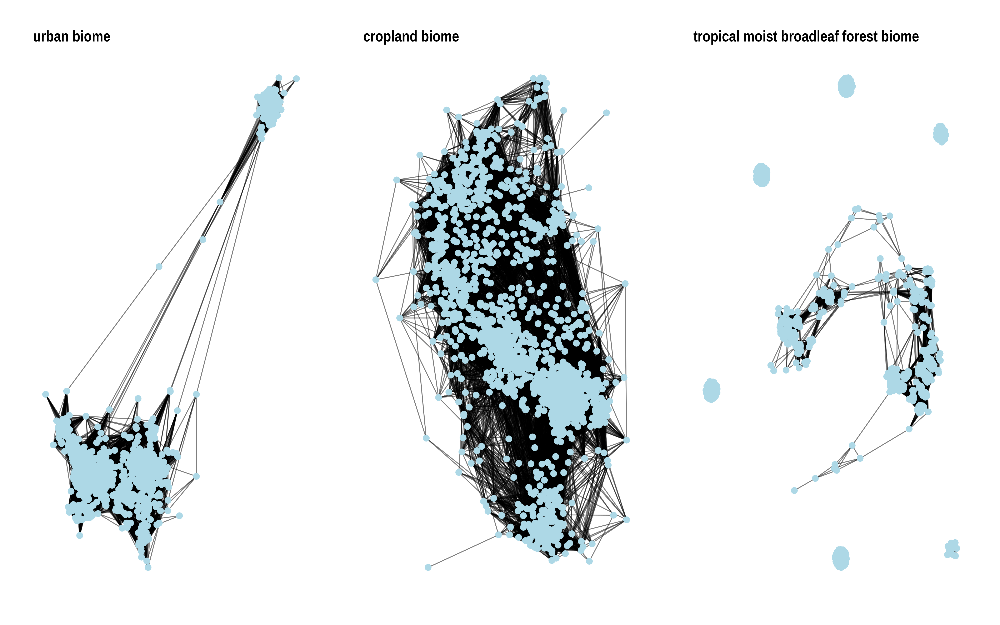
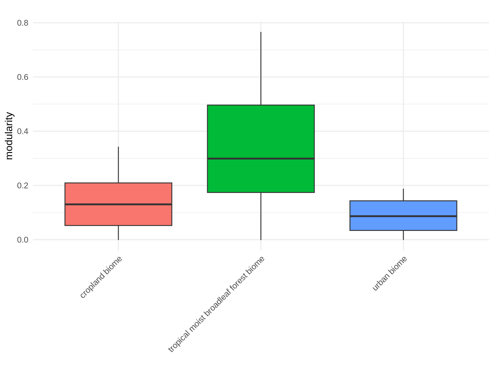

# Microbial Co-occurrence Network Analysis: EMP Soil Dataset
[](https://www.r-project.org/)
[](https://opensource.org/licenses/MIT)
[](https://github.com/username/network-analysis)

A comprehensive network ecology workflow demonstrating co-occurrence pattern analysis, network topology comparison, and community structure visualization using real microbiome data from the Earth Microbiome Project.



## 🌟 Overview

This pipeline demonstrates advanced microbial network ecology using real data from the Earth Microbiome Project (EMP). The workflow integrates correlation-based network construction with comparative topology analysis to reveal co-occurrence patterns across different soil environments.

### Key Features

- **Real microbiome data** from Earth Microbiome Project
- **Multi-environment network comparison** (cropland, forest, urban soils)
- **Statistical correlation analysis** using Spearman correlation with significance testing
- **Network topology quantification** including modularity, transitivity, and connectivity
- **Publication-ready visualizations** with force-directed network layouts
- **Cross-environment statistical comparison** of network properties

## 📋 Table of Contents

- [Installation](#installation)
- [Data Requirements](#data-requirements)
- [Quick Start](#quick-start)
- [Workflow Overview](#workflow-overview)
- [License](#license)

## 🚀 Installation

### Prerequisites

- R (≥ 4.0.0)
- EMP dataset files (see [Data Requirements](#data-requirements))

### Required R Packages

```r
# Install required packages
install.packages(c(
  # Network analysis
  "igraph", "ggraph", "tidygraph", "spdep",
  
  # Microbiome analysis
  "phyloseq", "vegan", "microbiome", "picante",
  
  # Statistical analysis
  "psych", "progress",
  
  # Data manipulation and visualization
  "tidyverse", "ggplot2", "patchwork", "ggpubr",
  "scales", "randomcoloR", "ggraph", "purrr"
))

# Bioconductor packages
if (!require("BiocManager", quietly = TRUE))
    install.packages("BiocManager")
BiocManager::install("phyloseq")
```

### Clone Repository

```bash
git clone https://github.com/username/microbial-network-analysis.git
cd microbial-network-analysis
```

## 📁 Data Requirements

### Earth Microbiome Project Files

Download the following files from the [Earth Microbiome Project](https://earthmicrobiome.org/):

```
data/
├── emp_deblur_150bp.subset_2k.biom    # OTU abundance table
└── emp_qiime_mapping_release1.tsv     # Sample metadata
```

### File Descriptions

| File | Description | Size |
|------|-------------|------|
| `emp_deblur_150bp.subset_2k.biom` | Deblurred OTU table (150bp, 2k samples) | ~50 MB |
| `emp_qiime_mapping_release1.tsv` | Sample metadata with environmental context | ~2 MB |

## ⚡ Quick Start

### 1. Generate Analysis Report

```r
# Render the R Markdown report
rmarkdown::render("microbial_network_analysis.Rmd")
```

### 2. View Results

The analysis generates several key outputs:
- `network_graphs.png` - Force-directed network visualizations
- `network_metrics.png` - Modularity comparison across environments
- `network_comparison.png` - Comprehensive topology metrics
- `statistical_comparison.png` - Cross-environment statistical analysis
- `network_topology_metrics.csv` - Quantitative network properties
- `microbial_networks.rds` - Network objects for further analysis

## 🔄 Workflow Overview

### 1. Data Import and Environmental Filtering
- Import EMP BIOM and metadata files
- Filter for soil samples across cropland, forest, and urban environments
- Quality control: retain taxa with >50 reads, sites with ≥100 taxa

### 2. Co-occurrence Network Construction
- Calculate pairwise Spearman correlations for each environment
- Apply statistical significance filtering (p < 0.05)
- Retain positive correlations above threshold (|r| > 0.6)
- Convert correlation matrices to igraph network objects
- Undirected, weighted, positive correlations only

```r
# Spearman correlation with significance testing
res <- cor.test(otu_rel[i, ], otu_rel[j, ], method = "spearman")
cor_mat[i, j] <- res$estimate
p_mat[i, j] <- res$p.value

# Filter for positive, significant correlations
cor_mat[abs(cor_mat) < cutoff | p_mat > pval_cutoff] <- 0
cor_mat[cor_mat < 0] <- 0  # Remove negative correlations
```

### 3. Network Topology Analysis
- Quantify structural properties: nodes, edges, degree distribution
- Calculate global metrics: transitivity, modularity, density
- Community detection using fast greedy algorithm
- Cross-environment comparative analysis

### 4. Statistical Network Comparison
- Compare network properties across environmental contexts
- Identify environments with highest modularity and connectivity
- Visualize relationships between network size and structure



## 🏷️ Keywords

microbial ecology, network analysis, co-occurrence networks, Earth Microbiome Project, correlation networks, modularity, community structure, soil microbiome, environmental microbiology, graph theory, network topology, igraph, R programming, bioinformatics

## 📧 Contact

- **Author**: Manuel García Ulloa Gamiz, PhD
- **Email**: manuel.garcia@example.com
- **LinkedIn**: [manuelgug](https://linkedin.com/in/manuelgug)
- **ORCID**: [0000-0002-6194-9565](https://orcid.org/0000-0002-6194-9565)

## 📄 License

This project is licensed under the MIT License - see the [LICENSE](LICENSE) file for details.

---

⭐ **Star this repository if you find it useful for your network ecology research!**
